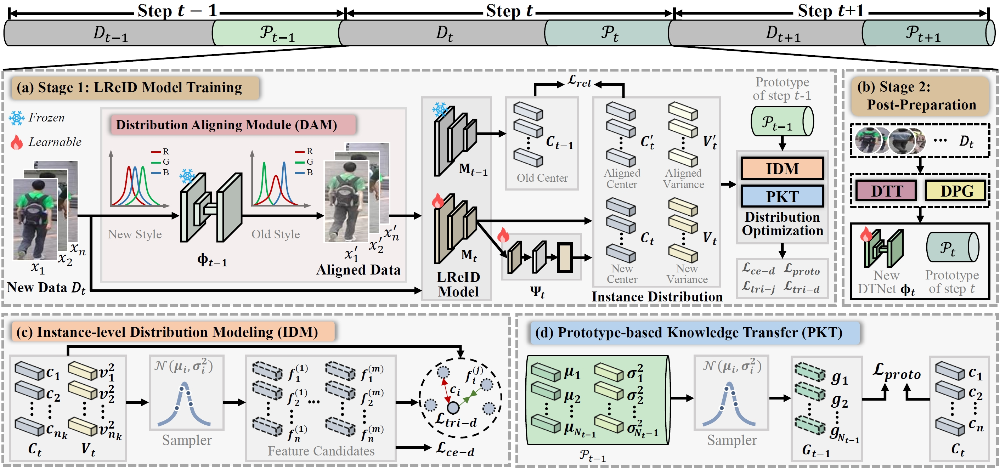
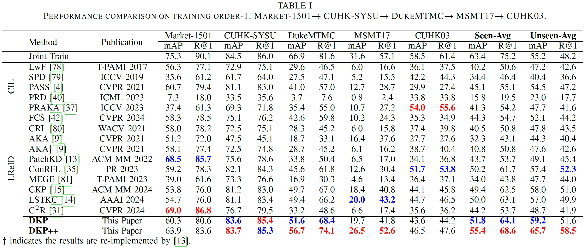
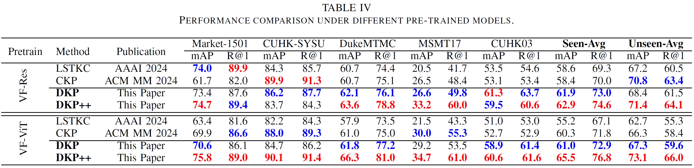

# [TPAMI 2025] Distribution-aware Knowledge Aligning and Prototyping for Non-exemplar Lifelong Person Re-Identification

<div align="center">

<div>
      Jiahuan Zhou<sup>1</sup>&emsp; Kunlun Xu<sup>1</sup>&emsp; Fan Zhuo<sup>1</sup>&emsp; Xu Zou<sup>2</sup>&emsp; Yuxin Peng<sup>1*</sup>
  </div>
<div>

  <sup>1</sup>Wangxuan Institute of Computer Technology, Peking University&emsp; <sup>2</sup>School of Artificial Intelligence and Automation, Huazhong University of Science and Technology

</div>
</div>
<p align="center">
  <a href="https://github.com/zhoujiahuan1991/TPAMI-DKP_Plus_Plus"></a>
</p>

The *official* repository for  [Distribution-aware Knowledge Aligning and Prototyping for Non-exemplar Lifelong Person Re-Identification](https://ieeexplore.ieee.org/abstract/document/11120364/).

## News
* 🔥[2024.04.07] The code for DKP (accepted by CVPR 2024) is released in [DKP Code](https://github.com/zhoujiahuan1991/CVPR2024-DKP)!
* 🔥[2024.06.19] The full paper for DKP is publicly available in [DKP Paper](https://openaccess.thecvf.com/content/CVPR2024/html/Xu_Distribution-aware_Knowledge_Prototyping_for_Non-exemplar_Lifelong_Person_Re-identification_CVPR_2024_paper.html)!
* 🔥[2025.07.26] Our improved verison DKP++ is accepted by IEEE TPAMI. The full paper is available in [DKP++ Paper](https://ieeexplore.ieee.org/abstract/document/11120364/)!
* 🔥[2025.08.14] The code for DKP++ is released in [DKP++ Code](https://github.com/zhoujiahuan1991/DKP-Plus-Plus).




## Installation
```shell
conda create -n IRL python=3.9
conda activate IRL
pip install torch==1.13.1+cu117 torchvision==0.14.1+cu117 torchaudio==0.13.1 --extra-index-url https://download.pytorch.org/whl/cu117
pip install -r requirements.txt
python setup.py develop
```
## Prepare Datasets
Download the person re-identification datasets [Market-1501](https://drive.google.com/file/d/0B8-rUzbwVRk0c054eEozWG9COHM/view), [MSMT17](http://www.pkuvmc.com/dataset.html), [CUHK03](https://github.com/zhunzhong07/person-re-ranking/tree/master/evaluation/data/CUHK03), [SenseReID](https://drive.google.com/file/d/0B56OfSrVI8hubVJLTzkwV2VaOWM/view?resourcekey=0-PKtdd5m_Jatmi2n9Kb_gFQ). Other datasets can be prepared following [Torchreid_Datasets_Doc](https://kaiyangzhou.github.io/deep-person-reid/datasets.html) and [light-reid](https://github.com/wangguanan/light-reid).
Then unzip them and rename them under the directory like
```
PRID
├── CUHK01
│   └──..
├── CUHK02
│   └──..
├── CUHK03
│   └──..
├── CUHK-SYSU
│   └──..
├── DukeMTMC-reID
│   └──..
├── grid
│   └──..
├── i-LIDS_Pedestrain
│   └──..
├── MSMT17_V2
│   └──..
├── Market-1501
│   └──..
├── prid2011
│   └──..
├── SenseReID
│   └──..
└── viper
    └──..
```

## Quick Start

```shell
CUDA_VISIBLE_DEVICES=1 python train_transfer.py --logs-dir transfer_model  --data-dir /path/to/PRID
```


Reproduce the reported results
```shell
CUDA_VISIBLE_DEVICES=7 python continual_train.py  --data-dir path/to/PRID
(for example, CUDA_VISIBLE_DEVICES=7 python continual_train.py --data-dir ../DATA/PRID)
```
or run the bash file
```shell
sh reproduce.sh
```


## Results
The following results were obtained using two NVIDIA 4090 GPUs:




## Citation
If you find this code useful for your research, please cite our paper.
```shell
@article{zhou2025distribution,
  title={Distribution-Aware Knowledge Aligning and Prototyping for Non-Exemplar Lifelong Person Re-Identification},
  author={Zhou, Jiahuan and Xu, Kunlun and Zhuo, Fan and Zou, Xu and Peng, Yuxin},
  journal={IEEE Transactions on Pattern Analysis and Machine Intelligence},
  year={2025},
  publisher={IEEE}
}
```
### We have conducted a series of research in Lifelong Person Re-Identification as follows.

#### Semi-Supervised Lifelong Person Re-Identification:
```shell
@inproceedings{xu2025self,
  title={Self-Reinforcing Prototype Evolution with Dual-Knowledge Cooperation for Semi-Supervised Lifelong Person Re-Identification},
  author={Xu, Kunlun and Zhuo, Fan and Li, Jiangmeng and Zou, Xu and Jiahuan Zhou},
  booktitle={Proceedings of the IEEE/CVF International Conference on Computer Vision},
  year={2025}
}
```

#### Imgae-level Distribution Modeling and Transfer:
```shell
@inproceedings{xu2025dask,
  title={Dask: Distribution rehearsing via adaptive style kernel learning for exemplar-free lifelong person re-identification},
  author={Xu, Kunlun and Jiang, Chenghao and Xiong, Peixi and Peng, Yuxin and Zhou, Jiahuan},
  booktitle={Proceedings of the AAAI Conference on Artificial Intelligence},
  volume={39},
  number={9},
  pages={8915--8923},
  year={2025}
}
```
#### Feature-level Distribution Modeling and Prototyping:
```shell
@inproceedings{xu2024distribution,
  title={Distribution-aware Knowledge Prototyping for Non-exemplar Lifelong Person Re-identification},
  author={Xu, Kunlun and Zou, Xu and Peng, Yuxin and Zhou, Jiahuan},
  booktitle={Proceedings of the IEEE/CVF Conference on Computer Vision and Pattern Recognition},
  pages={16604--16613},
  year={2024}
}
```
#### Long Short-Term Knowledge Rectification and Consolidation:
```shell
@article{xu2025long,
  title={Long Short-Term Knowledge Decomposition and Consolidation for Lifelong Person Re-Identification},
  author={Xu, Kunlun and Liu, Zichen and Zou, Xu and Peng, Yuxin and Zhou, Jiahuan},
  journal={IEEE Transactions on Pattern Analysis and Machine Intelligence},
  year={2025},
  publisher={IEEE}
}


@inproceedings{xu2024lstkc,
  title={Lstkc: Long short-term knowledge consolidation for lifelong person re-identification},
  author={Xu, Kunlun and Zou, Xu and Zhou, Jiahuan},
  booktitle={Proceedings of the AAAI Conference on Artificial Intelligence},
  volume={38},
  number={14},
  pages={16202--16210},
  year={2024}
}
```
#### Lifelong Learning with Label Noise:
```shell
@inproceedings{xu2024mitigate,
  title={Mitigate Catastrophic Remembering via Continual Knowledge Purification for Noisy Lifelong Person Re-Identification},
  author={Xu, Kunlun and Zhang, Haozhuo and Li, Yu and Peng, Yuxin and Zhou, Jiahuan},
  booktitle={Proceedings of the 32nd ACM International Conference on Multimedia},
  pages={5790--5799},
  year={2024}
}
```

#### Prompt-guided Adaptive Knowledge Consolidation:
```shell
@article{li2024exemplar,
  title={Exemplar-Free Lifelong Person Re-identification via Prompt-Guided Adaptive Knowledge Consolidation},
  author={Li, Qiwei and Xu, Kunlun and Peng, Yuxin and Zhou, Jiahuan},
  journal={International Journal of Computer Vision},
  pages={1--16},
  year={2024},
  publisher={Springer}
}
```

#### Compatible Lifelong Learning:
```shell
@inproceedings{cui2024learning,
  title={Learning Continual Compatible Representation for Re-indexing Free Lifelong Person Re-identification},
  author={Cui, Zhenyu and Zhou, Jiahuan and Wang, Xun and Zhu, Manyu and Peng, Yuxin},
  booktitle={Proceedings of the IEEE/CVF Conference on Computer Vision and Pattern Recognition},
  pages={16614--16623},
  year={2024}
}
```

## Acknowledgement
Our code is based on the PyTorch implementation of [PatchKD](https://github.com/feifeiobama/PatchKD) and [PTKP](https://github.com/g3956/PTKP).

## Contact

For any questions, feel free to contact us (xkl@stu.pku.edu.cn).

Welcome to our Laboratory Homepage ([OV<sup>3</sup> Lab](https://zhoujiahuan1991.github.io/)) for more information about our papers, source codes, and datasets.

